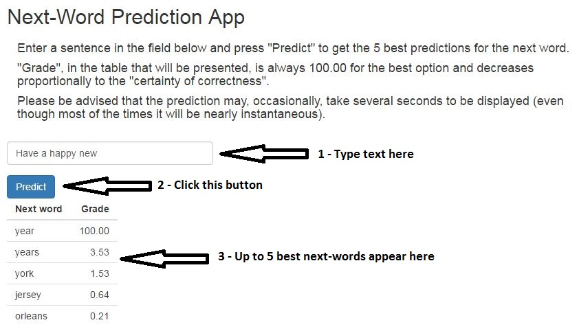

Next-Word Predictor
===
author: Eduardo F. del Peloso
date: 09/28th/2016
transition: linear

<small> 
Data Science Capstone 
Final Project of the specialization on Data Science
at the Johns Hopkins University (through Coursera)
</small>

The objective of this project is the development of an app
that takes a string of words typed by the user and predicts
the next word the user would like to type.
Development was based in a statistical analysis of three
English language corpora taken from [HC Corpora](http://www.corpora.heliohost.org/).

Analysis Algorithm (1)
========================================================

Initially the corpora were cleaned by converting all characters to lower case and removing control characters, redundant white spaces, numbers and puctuation.
Stop words were not removed, as they are essential for a correct next-word prediction.

In order to cope with limited amounts of available RAM and processing time,
we used a random sample containing 5 % of the entries in the corpora.

Package 'quanteda' was employed to create files with all 2-grams, 3-grams and
4-grams (see [Wikipedia](https://en.wikipedia.org/wiki/N-gram)) from the corpora. We converted all text from 'factor' (which is the dafault
class for text in a R data.frame) to 'character'. We also removed entries with only
one count in the corpora. This saved a lot of space, 
reducing the n-grams files from a total of 839 MB to 61 MB. Loading times were
also greatly reduced.

Analysis Algorithm (2)
========================================================

Analysis works by looking for matches between input string and n-grams, using [Stupid Back-off smoothing](http://www.aclweb.org/anthology/D07-1090.pdf):

1. Look for matches between string and 4-grams. If found, grade them by relative frequency. If >=&nbsp;5&nbsp;matches are found, go to step&nbsp;4; if not, back off (go to step&nbsp;2).

2. Look for matches between string and 3-grams. If there were matches in step&nbsp;1, add the ones in this step, but with a grade penalty: multiply grades by&nbsp;0.4. If total number of matches is&nbsp;>=&nbsp;5, go to step&nbsp;4; if not, back off (go to step&nbsp;3).

3. Repeat step&nbsp;2, but using 2-grams. This time apply a double penalty: multiply grades 2&nbsp;times by&nbsp;0.4.

4. Display up to 5 next-word predictions.

The "Next-Word Prediction App" (1)
========================================================

The app can be accessed through shinyapps.io: [https://eduardodelpeloso.shinyapps.io/WordPredict/](https://eduardodelpeloso.shinyapps.io/WordPredict/)

The "Next-Word Prediction App" (2)
========================================================

The app interface is minimalist, and consists of a text input field and a button. The user types a sentence in the field (previous slide, arrow&nbsp;1), and clicks the button (previous slide, arrow&nbsp;2) to invoke the R function that implements the next-word prediction algorithm.

The function first applies to the sentence the same cleaning procedures employed in the corpora that were used to generate the n-grams. Then it runs the matching algorithm described before, with Stupid Back-off smoothing.

If the function finds one or more matches, results are shown as a table with up to 5&nbsp;rows (previous slide, arrow&nbsp;3). Each row contains a next-word prediction and a grade, that is always 100.00 for the most probable next-word. Grade is an estimate of the "certainty of correctness" of the prediction.
